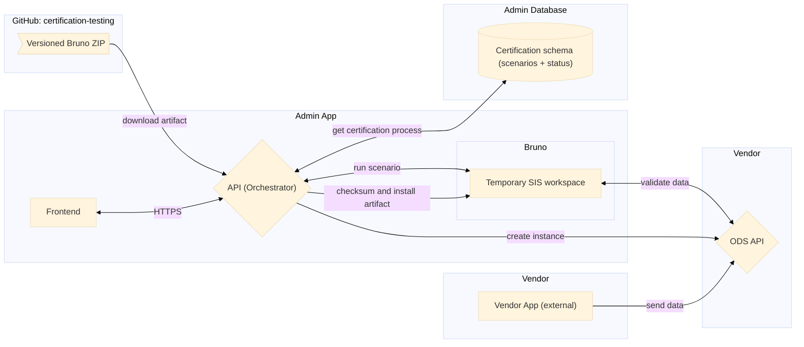
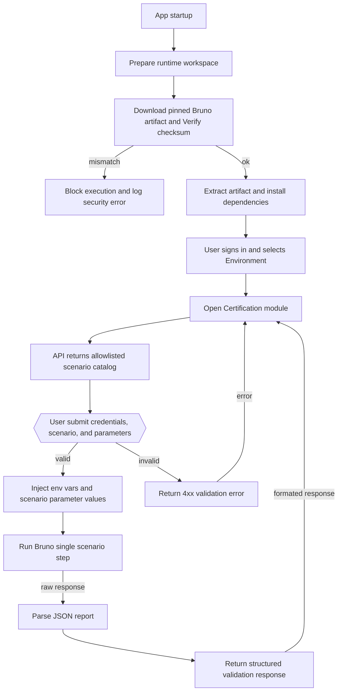
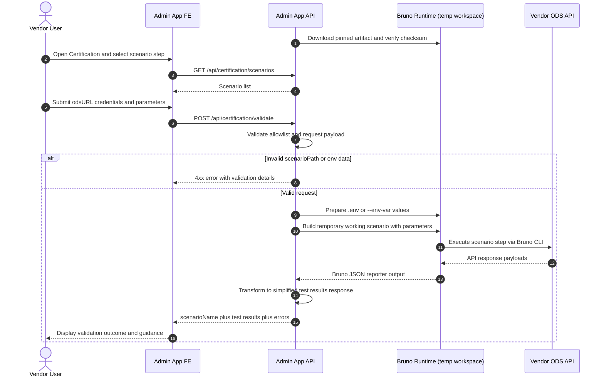
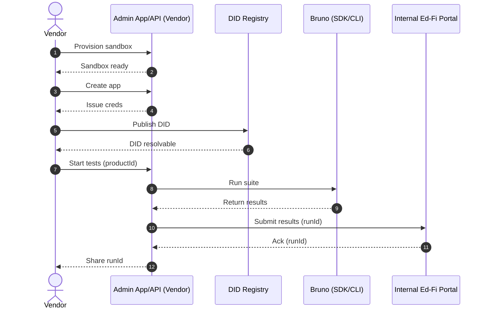
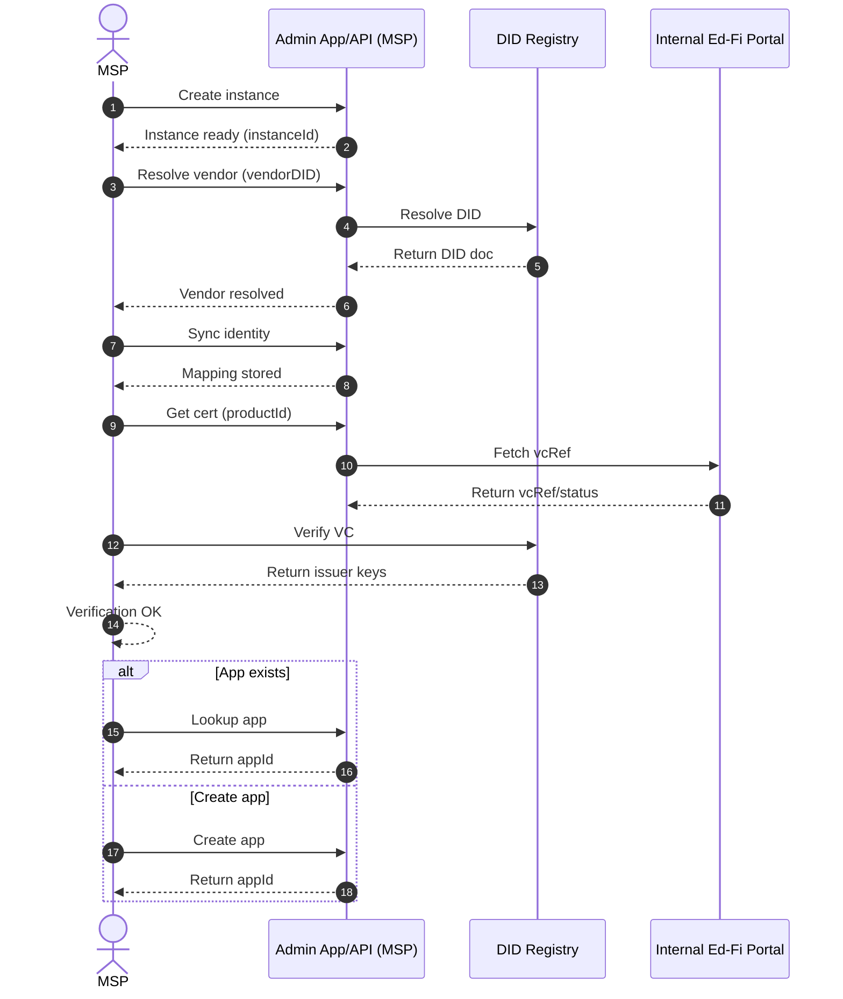
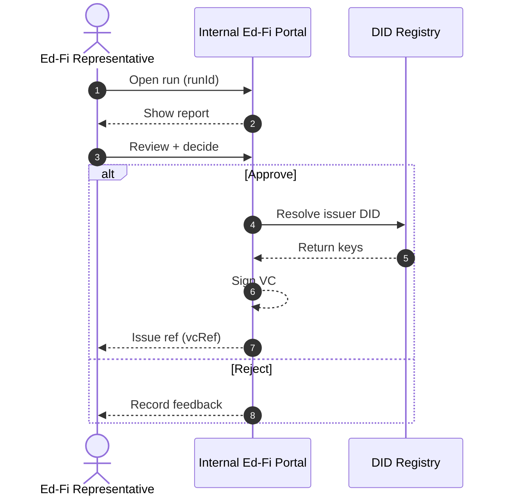
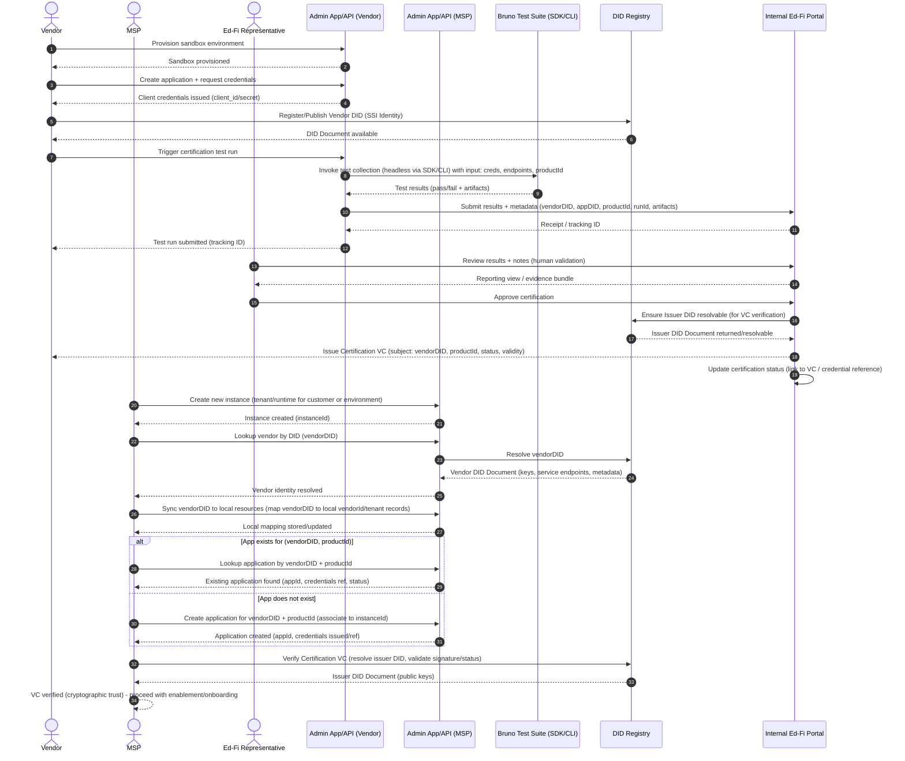

# CERT-220 - Technical Brief for Certification Release 2.1 (Phase 1)

- [1. Purpose](#1-purpose)
- [2. Executive Summary](#2-executive-summary)
- [3. Phase 1 Scope Boundaries](#3-phase-1-scope-boundaries)
- [4. Architecture Overview](#4-architecture-overview)
- [5. Certification Lifecycle](#5-certification-lifecycle)
- [6. Phase 1 Certification Workflow](#6-phase-1-certification-workflow)
- [7. Comparison: Total Scope vs Phase 1 Scope](#7-comparison-total-scope-vs-phase-1-scope)
- [8. Work Items and Acceptance Criteria](#8-work-items-and-acceptance-criteria)
- [9. Delivery Constraints, Risks, and Mitigations](#9-delivery-constraints-risks-and-mitigations)
- [10. Technical Decision Summary](#10-technical-decision-summary)
- [Appendix A - Retained Story Details](#appendix-a---retained-story-details)
- [Appendix B - POCs and Feasibility Notes](#appendix-b---pocs-and-feasibility-notes)
- [Appendix C - Certification 2026 sequence workflows](#appendix-c---certification-2026-sequence-workflows)

## 1. Purpose

This document defines the technical scope and delivery plan for Certification Release 2.1 (Phase 1) in Admin App.

The goal is to deliver a basic but reliable certification experience that allows vendors to run certification checks with minimal outside assistance, aligned with the 2026 project direction to move toward same-day certification.

Reference used: [Certifications Project 2026](https://edfi.atlassian.net/wiki/spaces/OTD/pages/1894154241/Certifications+Project+2026) overview (Atlassian summary provided by stakeholder).

## 2. Executive Summary

Certification currently depends on manual execution and review of Bruno collections from the `certification-testing` [repository](https://github.com/Ed-Fi-Alliance-OSS/certification-testing).

Phase 1 modernizes this by integrating Bruno execution into Admin App with a simple user flow:

1. User selects the environment.
2. User provides credentials.
3. User selects a certification scenario step.
4. Admin App validates inputs and allowlisted scenario path.
5. Admin App runs Bruno for that scenario step.
6. Admin App returns structured validation results to the UI.

This phase is intentionally reduced to fit a `2-sprint` window and validate core workflow viability.

## 3. Phase 1 Scope Boundaries

### In Scope

- Import Bruno artifacts through a deterministic, versioned contract.
- Validate artifact integrity using published checksums.
- Expose scenarios catalog API.
- Expose scenario validation API.
- Execute single scenario steps from Bruno in a temporary working folder.
- Return structured validation results to the frontend.
- Add frontend pages for scenario list and scenario execution.

### Out of Scope (Deferred)

- Sandbox provisioning.
- App creation and credential issuance automation.
- Decentralized ID (DID) validation ([1EdTech Uniform Id](https://www.1edtech.org/standards/uniform-id-framework)).
- Registry certification approval process.
- Internal portal decision workflow (approve/reject).
- Verifiable Credential (VC) issuance.
- Advanced instance management automation (planned for later phases).

## 4. Architecture Overview

### Source of truth

- The `certification-testing` repository remains the source of truth for scenario definitions.
- Admin App consumes a published Bruno artifact; it does not own scenario authoring.

### Runtime model

- On startup, Admin App downloads the pinned artifact version.
- Admin App verifies checksum before extraction.
- Admin App installs runtime dependencies from lockfile (`npm ci` preferred).
- On validation request, Admin App creates a temporary working scenario, runs Bruno CLI, parses JSON report, and returns a simplified response.



__Description:__

- `certification-testing` publishes artifacts; Admin App consumes artifacts.
- Admin App owns orchestration, validation, and response shaping.
- Vendor ODS remains external and is tested through Bruno CLI.

## 5. Certification Lifecycle



__Description:__

- Steps before execution focus on safety (`allowlist`, payload checks, checksum verification).
- Execution is limited to one scenario step at a time to keep behavior deterministic.
- Output is translated into a UI-friendly structure for vendor self-service.

## 6. Phase 1 Certification Workflow



__Description:__

- The API is the control point for validation and safety.
- Bruno runtime is temporary and scoped to execution.
- User sees structured results, not raw CLI logs.


## 7. Comparison: Total Scope vs Phase 1 Scope

| Capability / Step | Provided Diagrams (Target State) | Phase 1 (This Brief) | Scope Status |
| --- | --- | --- | --- |
| Sandbox provision | Included | Not implemented | Out of scope |
| App creation | Included | Not implemented | Out of scope |
| Credential issuance from provisioning flow (DID) | Included | User provides credentials manually | Out of scope |
| DID validation | Included | Not implemented | Out of scope |
| Trigger certification tests | Included | Included | In scope |
| Execute test suite | Full suite model | Single scenario-step execution | Reduced in scope |
| Submit run results to internal portal | Included | Not implemented | Out of scope |
| Representative approval / rejection | Included | Not implemented | Out of scope |
| Registry-backed certificate actions | Included | Not implemented | Out of scope |

__Summary:__

- Phase 1 intentionally focuses on the basic execution loop: select scenario, provide parameters, run validation, return structured results.
- Platform-level orchestration and registry workflows are deferred to future phases.

## 8. Work Items and Acceptance Criteria

### 8.1 Certification - Export Bruno Artifacts

Objective: Publish a deterministic Bruno artifact contract for Admin App consumption.

Acceptance criteria:

- CI publishes versioned Bruno artifact on merge to `main` and on release tags.
- Artifact includes required `bruno` workspace content and excludes local-only folders.
- Artifact metadata is traceable (`artifactVersion`, `gitCommitSha`, `buildTimestamp`).
- Checksum (for example SHA256) is published alongside artifact.
- Artifact contract is documented (URL pattern, auth model, version format).
- Consumer validation proves Admin App can download and extract by contract only.

User Story: [CERT-222](https://edfi.atlassian.net/browse/CERT-222)

### 8.2 Admin App API - Import Bruno Artifacts

Objective: Replace local sibling-repo copy model with pinned artifact download and verification.

Acceptance criteria:

- Admin App downloads pinned artifact at startup into temporary runtime folder.
- Integrity verification blocks execution on checksum mismatch with clear logging.
- Artifact is extracted and dependencies are installed via lockfile (`npm ci` preferred).
- Imported `SIS` collection can run from Bruno CLI with environment inputs.

User Story: [AC-462](https://edfi.atlassian.net/browse/AC-462)

### 8.3 Admin App API - Certification Scenarios API

Objective: Expose scenario catalog used by frontend selection UI.

Acceptance criteria:

- Endpoint exposed at `/api/certification/scenarios`.
- Endpoint returns configured allowlisted scenarios from `certification-scenarios.json`.
- No pagination or filtering in Phase 1.

User Story: [AC-463](https://edfi.atlassian.net/browse/AC-463)

### 8.4 Admin App API - Scenario Validator Service

Objective: Validate one scenario step with strict input safety and structured result response.

Acceptance criteria:

- Replace `/api/certification/run` with `/api/certification/validate`.
- Enforce authorization with `@Authorize(...)`; remove `@Public()`.
- Reject invalid `scenarioPath` and invalid environment inputs with `4xx` before command execution.
- Build temporary working scenario with parameter replacements.
- Execute working scenario from `bruno` collection root.
- Record execution metadata (`artifactVersion`, `commitSha`, scenario, duration, exitCode).
- Clean stale temporary work folders based on retention policy.
- Return structured response with scenario name and test results.

User Story: [AC-466](https://edfi.atlassian.net/browse/AC-466)

### 8.5 Admin App FE - Certification Module

Objective: Add UI entry point and list view for certification scenarios.

Certification Menu:


Certification Page with scenario list:


Acceptance criteria:

- Add `Certification` option in the selected `Environment` menu.
- Show a dedicated Certification page.
- Display scenarios returned by `/api/certification/scenarios`.

User Story: [AC-467](https://edfi.atlassian.net/browse/AC-467)

### 8.6 Admin App FE - Certification Process Page

Objective: Let users execute a selected scenario with dynamic parameter inputs and view results.

Certification Page with scenario list:


Acceptance criteria:

- Show Certification Process page for selected scenario.
- Dynamically render parameter fields from scenario configuration.
- Send credentials plus required parameters to validation endpoint.
- Display structured validation response from API.

User Story: [AC-465](https://edfi.atlassian.net/browse/AC-465)

## 9. Delivery Constraints, Risks, and Mitigations

### Constraints

- Phase 1 development is limited to `2 sprints`. Please note that __team capacity and diluted focus__ could affect our overall delivery velocity.
- Self-service is a first-order product requirement.
- Bruno scripts are largely static by design.

### Key risks

- High integration complexity across two incompatible repositories (React and Bruno scripts).
- Runtime command execution increases operational and security sensitivity.
- Response normalization from CLI output can be error-prone.
- Bruno scripts are sensitive to version and structural shifts; small modifications can easily lead to breaking changes.
- The `certification-testing` solution only supports DataStandard `v4`. A modernization to `v5` is required to support both versions.

### Mitigations

- Reduced scope for Phase 1.
- Independent runtime workspace inside Admin App for Bruno scripts.
- Certification scenario validations are delegated to Bruno CLI to reduce breaking-change risk.
- Keep `certification-testing` as source of truth and consume versioned artifacts.
- Enforce allowlist and checksum validation before execution.
- Limit execution to single scenario-step in Phase 1.
- Log traceability metadata for supportability and audits.

## 10. Technical Decision Summary

Selected approach: Bruno Integrator model (POC 2) with artifact pinning.

Rationale:

- Lowest implementation complexity for Phase 1.
- Better compatibility with upstream scenario changes.
- Aligns with reduced-scope objective while preserving future extensibility.

## Appendix A - Retained Story Details

### A.1 Context

The [Certification](https://github.com/Ed-Fi-Alliance-OSS/certification-testing) solution uses [Bruno](https://docs.usebruno.com/) collections to validate ODS API behavior.

Admin App will provide UI-guided execution so users can run scenario validations with required credentials and parameters and receive user-friendly result summaries.

### A.2 Repository Layouts

`certification-testing` Bruno layout (logical):

- `bruno/SIS/environments`
- `bruno/SIS/.env`
- `bruno/SIS/v4/<ScenarioGroups>/<ScenarioNames>/<ScenarioSteps>`

Admin App extension points:

- `packages/api/src/certification`
- `packages/api/src/certification/bruno` (runtime artifact workspace)
- `packages/fe/src/Pages/Certification`

### A.3 Phase 1 Workflow Inputs Already Available

- User logs into Admin App.
- User creates Environment and ODS Instance settings.
- User selects Environment.

### A.4 Certification Workflow (Phase 1)

- On startup, Admin App creates a temporary local copy from published artifact.
- User opens Certification feature.
- User enters credentials.
- User selects scenario.
- Admin App displays scenario details (parameters).
- User provides parameters and submit for validation.
- Admin App updates a temporary working scenario.
- Admin App executes Bruno request(s).
- Admin App returns a simplified response based on results and validation errors.

### A.5 Story Detail - Export Bruno Artifacts

__Description:__

- In `certification-testing`, publish Bruno workspace artifacts consumable by Admin App.

__Considered options:__

- Option A: GitHub Release ZIP artifact (recommended for Phase 1).
- Option B: Azure Artifacts/NuGet package.
- Option C: npm package content bundle.
- Option D: Local sibling-repo folder copy.
- Option E: Dedicated Certification Runner API.

__Why Option A for Phase 1:__

- Simpler startup integration and deterministic version pinning.
- Supports integrity checks and traceability.
- Avoids introducing a new production service before workflow validation.

### A.6 Story Detail - Import Bruno Artifacts (Admin App API)

*Artifact Configuration*: Add configuration entries for certification source reference:

- `CERT_BRUNO_SRC_REF` (tag/commit)
- `CERT_BRUNO_SRC_CHECKSUM` (optional artifact integrity check)

*Download Artifact:* Admin App API will replace the POC local copy approach with a pinned artifact download contract, generated in [CERTIFICATION - Export artifacts](./CERT-220.md#a5-story-detail---export-bruno-artifacts).
*Integrity Validation:* Add checksum verification before extraction; block execution on mismatch.
*Install Dependencies:* Install dependencies (`node_modules`) from the artifact lockfile path (`npm ci` preferred).
*Initialization:* Bruno requires two files to work properly. Create the following files with placeholders (actual values are overwritten in [ADMIN APP - API - Scenario Validator Service](./CERT-220.md#a8-story-detail---scenario-validator-service)):

The `SIS/.env` file:

``` txt
EDFI_CLIENT_ID=<replace_with_edfiClientId_parameter>
EDFI_CLIENT_SECRET=<replace_with_edfiClientSecret_parameter>
```

The `SIS/environments/<environment-name>.bru` file:

```json
vars {
  baseUrl: https://localhost/odsv7-adminv2-multi-api/tenant1
  resourceBaseUrl: {{baseUrl}}/data/v3
  oauthUrl: {{baseUrl}}/oauth/token
  edFiClientName: {{process.env.EDFI_CLIENT_NAME}}
  edFiClientId: {{process.env.EDFI_CLIENT_ID}}
  edFiClientSecret: {{process.env.EDFI_CLIENT_SECRET}}
}
```

> Alternative: Pass the environment variables directly to the Bruno CLI ([Passing Environment Variables](https://docs.usebruno.com/bru-cli/runCollection#passing-environment-variables))

```code
bru run --env-var EDFI_CLIENT_ID=<client_id> --env-var EDFI_CLIENT_SECRET=<secret>
```

__References:__

- [Environment example](https://github.com/Ed-Fi-Alliance-OSS/certification-testing/blob/main/bruno/SIS/environments/api.ed-fi.org.bru)
- [.env example](https://github.com/Ed-Fi-Alliance-OSS/certification-testing/blob/main/bruno/SIS/.env.example)
- [Using environment names](https://docs.usebruno.com/bru-cli/runCollection#using-environments-names)
- [Secrets management](https://docs.usebruno.com/secrets-management/dotenv-file)
- [Using JSON environment files](https://docs.usebruno.com/bru-cli/runCollection#using-json-environment-files)

### A.7 Story Detail - Certification Scenarios API

__Description:__

A new API is required to return the list of configured certification scenarios to the frontend from `certification-scenarios.json`.

*Expose New API:* Create a new endpoint `/api/certification/scenarios`. The API receives no parameters, pagination, or filtering.
*Mapping:* Map the desired certification scenarios configuration in a JSON file `certification-scenarios.json` with the schema below.

```json
  {
    [
      {
        "scenariosVersion": "v4",
        "scenariosGroup": "MasterSchedule",
        "scenariosName": "BellSchedules",
        "scenarioStep": "01 - Check BellSchedule is valid",
        "scenarioType": "CREATE", // CREATE | UPDATE | DELETE
        "parameters": [
          {
            "name": "schoolId",
            "description": "School id"
          },
          {
            "name": "bellScheduleName",
            "description": "BellSchedule name"
          }
        ]
      },
      {
        "scenariosVersion": "v4",
        "scenariosGroup": "EducationOrganization",
        "scenariosName": "ClassPeriods",
        "scenarioStep": "01 - Check First ClassPeriod is valid",
        "scenarioType": "CREATE", // CREATE | UPDATE | DELETE
        "parameters": [
          {
            "name": "schoolId",
            "description": "School id"
          },
          {
            "name": "bellScheduleName",
            "description": "BellSchedule name"
          }
        ]
      },
      {
        "scenariosVersion": "v4",
        "scenariosGroup": "EducationOrganization",
        "scenariosName": "ClassPeriods",
        "scenarioStep": "03 - Check first ClassPeriod classPeriodName was Updated",
        "scenarioType": "UPDATE", // CREATE | UPDATE | DELETE
        "parameters": [
          {
            "name": "firstClassPeriodUniqueId",
            "description": "First ClassPeriod UniqueId"
          }
        ]
      }
    ]
  }
```

__Acceptance Criteria:__

- Admin App will expose a new API for the scenario list.

### A.8 Story Detail - Scenario Validator Service

__Description:__

Based on the [POC 2 - Bruno Integration](./CERT-220.md#poc-2-bruno-integrator-recommended), update the API `CertificationService` in Admin App and make the required adjustments:

*Expose New API:* Replace POC endpoint `/api/certification/run` with `/api/certification/validate` to validate certification scenarios. The API will receive the following parameters:

- odsURL (e.g. <https://localhost/odsv7-adminv2-multi-api/tenant1>)
- edfiClientId
- edfiClientSecret
- scenariosVersion
- scenariosGroup
- scenariosName
- scenarioStep
- parameters (e.g. schoolId, studentName, classPeriodId, etc.)

*Authorization:* Enforce authorization with `@Authorize(...)`, remove `@Public()`.

*Allowlist Params:* Add strict allowlist validation for `scenarioPath` against `certification-scenarios.json`; reject invalid input with `4xx` before command execution. Build the `scenarioPath` from the provided parameters `scenariosVersion`/`scenariosGroup`/`scenariosName`/`scenarioStep` (e.g. v4/MasterSchedule/BellSchedules/01 - Check BellSchedule is valid).

*Configuration:* Update the `SIS/environments/<environment-name>.bru` file. Update the `baseURL` with `odsURL` using the [Bruno CLI setup options](https://docs.usebruno.com/bru-cli/commandOptions#setup-options).

Using the `edfiClientId` and `edfiClientSecret` parameters, the API will update the `SIS/.env` file:

``` txt
EDFI_CLIENT_ID=<replace with edfiClientId parameter>
EDFI_CLIENT_SECRET=<replace with edfiClientSecret parameter>
```

> __Alternative:__ Pass the environment variables directly to the Bruno CLI ([Passing Environment Variables](https://docs.usebruno.com/bru-cli/runCollection#passing-environment-variables))

*Authentication:* Either through environment files or `--env-var` commands, the Certification Bruno solution is already prepared to authenticate and generate a new `token` (see [SIS collection](https://github.com/Ed-Fi-Alliance-OSS/certification-testing/blob/main/bruno/SIS/collection.bru)). Once authenticated, the `SIS collection` caches the generated `token`, so no additional token or credential handling is required.

*Validation:* Map the desired certification scenarios configuration in `certification-scenarios.json` using the schema defined in [ADMIN APP - API - Create a Certification Scenarios API](./CERT-220.md#a7-story-detail---certification-scenarios-api).

Bruno CLI returns a report ([Generating Reports](https://docs.usebruno.com/bru-cli/builtInReporters#json-report)) with all assertion and test statuses in the response data:

> __Important:__ Some commands like `--output` and `--format` are *DEPRECATED*  [Output & Reporting options](https://docs.usebruno.com/bru-cli/commandOptions#output-&-reporting-options)

```code
bru run --reporter-json results.json
```

*Structured API response:* Replace the raw console response with a simplified structured response.

Raw response:

```txt

    01 - Check BellSchedule is valid - API Response: {
      bellScheduleName: Normal Schedule,
      schoolId: 255901107,
      classPeriods: [
        01 - Traditional,
        05 - Traditional,
        06 - Traditional,
        07 - Traditional,
        02 - Traditional,
        04 - Traditional,
        03 - Traditional
      ],
      dates: [],
      startTime: 08:30:00,
      endTime: 15:50:00,
      alternateDayName: undefined,
      totalInstructionalTime: 350,
      id: 505c7aefa1244724987ec326cec4af17,
      lastModifiedDate: 2024-06-07T21:13:41.703707Z
    }

    Assertions

    ✓ res.status: eq 200
    ✓ res.body: isArray
    ✓ res.body: isNotEmpty
    ✓ res.body[0].id: isString
    ✓ res.body[0].id: isNotEmpty
    ✓ res.body[0].bellScheduleName: isString
    ✓ res.body[0].bellScheduleName: isNotEmpty
    ✕ res.body[0].alternateDayName: isString
       expected undefined to be a string
    ✕ res.body[0].alternateDayName: isNotEmpty
       .empty was passed non-string primitive undefined
    ✓ res.body[0].schoolReference: isDefined
    ✓ res.body[0].schoolReference.schoolId: isNumber
    ✓ res.body[0].schoolReference.schoolId: neq 0
    ✓ res.body[0].classPeriods: isArray
    ✓ res.body[0].classPeriods: isNotEmpty
    ✓ res.body[0].classPeriods[0].classPeriodReference: isDefined
    ✓ res.body[0].classPeriods[0].classPeriodReference.classPeriodName: isString
    ✓ res.body[0].classPeriods[0].classPeriodReference.classPeriodName: isNotEmpty
```

Simplified response: The Certification API parses and formats the Bruno CLI report in a JSON format that Admin App can handle:

```json
  {
    "scenarioStep": "01 - Check BellSchedule is valid",
    "lastModifiedDate": "2024-06-07T21:13:41.703707Z",
    "isValid": false,
    "successful": 15,
    "errors": 2,
    "validation-errors": [
      {
        "property": "alternateDayName",
        "validation": "isString",
        "error": "expected undefined to be a string"
      },
      {
        "property": "alternateDayName",
        "validation": "isNotEmpty",
        "error": ".empty was passed non-string primitive undefined"
      }
    ]
  }
```

__Acceptance Criteria:__

- Admin App will expose a new API for scenario validations.
- Admin App will reject invalid `scenarioPath` inputs with a 4xx response before command execution.
- Admin App will reject invalid `scenarioPath` and `env` inputs with a 4xx response before command execution.
- Admin App will generate a temporary `working` scenario with the replaced parameters.
- Admin App will execute the `working` scenario from the collection root (`bruno`).
- Admin App will record execution metadata (`artifactVersion`, `commitSha`, scenario, duration, exitCode) in logs for traceability.
- Admin App will clean stale temporary work folders based on retention policy (after execution).
- Admin App will return a structured API response with `scenarioName` and `TestsResults`.

__Dependencies:__

- [ADMIN APP - API - Import Bruno artifacts](./CERT-220.md#a6-story-detail---import-bruno-artifacts-admin-app-api)
- [ADMIN APP - API - Create a Certification Scenarios API](./CERT-220.md#a7-story-detail---certification-scenarios-api)

### A.9 Story Detail - FE Certification Module

__Description:__

As a user, once I properly configure the `Environment`, `ODS Instance`, and `Ownership`, and select the corresponding `Environment`, I want:

- The frontend to display a new `Certification` option in the `Environment` menu.
- When the user clicks on the `Certification` option, the frontend will display a new page to start the certification process.
- The frontend will display the list of certification scenarios defined in [ADMIN APP - API - Create a Certification Scenarios API](./CERT-220.md#a7-story-detail---certification-scenarios-api)

__Dependencies:__

- [ADMIN APP - API - Create a Certification Scenarios API](./CERT-220.md#a7-story-detail---certification-scenarios-api)

### A.10 Story Detail - FE Certification Process Page

__Description:__

As a user, once I select a certification scenario, I want:

- The frontend to display a new `Certification Process` page.
- The frontend will ask the user to enter the required parameters dynamically according to the parameters in the [certification scenarios](./CERT-220.md#a7-story-detail---certification-scenarios-api) list.
- When the user enters the parameters and sends the request, the frontend must send the client credentials and required parameters.
- The frontend must display the response from the API [ADMIN APP - API - Scenario Validator Service](./CERT-220.md#a8-story-detail---scenario-validator-service)

__Dependencies:__

- [ADMIN APP - API - Scenario Validator Service](./CERT-220.md#a8-story-detail---scenario-validator-service)
- [ADMIN APP - API - Create a Certification Scenarios API](./CERT-220.md#a7-story-detail---certification-scenarios-api)

## Appendix B - POCs and Feasibility Notes

To overcome the blockers mentioned in the [Delivery Constraints, Risks, and Mitigations](./CERT-220.md#9-delivery-constraints-risks-and-mitigations) section, many POCs were conducted to confirm feasibility and integration between `Ed-Fi-AdminApp` and `certification-testing`. It was determined that the connection is viable in two ways: a Bruno Parser and a Bruno Integrator (recommended option).

### POC 1 (Bruno Parser)

- Converts `.bru` scripts into executable JavaScript.
- Pros: high customization and direct parameterization.
- Cons: tighter coupling to upstream file structure.

### POC 2 (Bruno Integrator, recommended)

- Uses Bruno CLI with temporary working copies and parameter replacement.
- Pros: lower implementation complexity and better upstream compatibility.
- Cons: less direct execution control, CLI output handling complexity.

### Related PRs

For implementation details, review:

- [Bruno Parser: Ed-Fi-AdminApp](https://github.com/Ed-Fi-Alliance-OSS/Ed-Fi-AdminApp/pull/66)
- [Bruno Integrator: Ed-Fi-AdminApp](https://github.com/Ed-Fi-Alliance-OSS/Ed-Fi-AdminApp/pull/68)
- [Bruno Integrator: certification-testing](https://github.com/Ed-Fi-Alliance-OSS/certification-testing/pull/111)

## Appendix C - Certification 2026 sequence workflows

### Vendor Sequence diagram



### MSP Sequence diagram



### Representative Sequence diagram



### FULL Certification Sequence diagram


